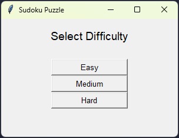
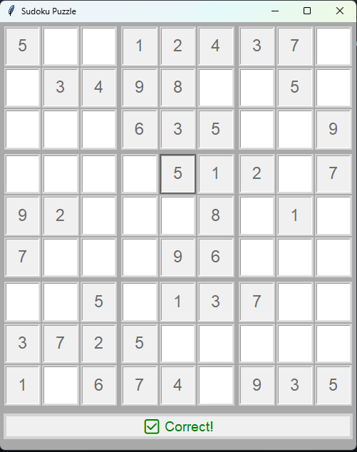

# 🧩 Sudoku Game - Python + Tkinter

This is a simple desktop Sudoku game built using **Python** and **Tkinter**. The game allows users to solve randomly generated Sudoku puzzles, validate their entries, and receive feedback on correctness with interactive GUI.

## ✅ Features

- Choose between:
  - 🧮 **Terminal mode**: Play by entering numbers through the console
  - 🖱 **UI mode**: Play with keyboard in a Tkinter-based GUI
- 9x9 Sudoku grid with 3x3 block borders
- Pre-filled numbers based on difficulty
- Real-time input validation (GUI mode)
- Feedback:
  - ✅ Green for correct input
  - ❌ Red for incorrect input
- Win detection with a celebratory message 🎉

## 🖼️ Screenshot



## 🛠 Requirements

- Python 3.x
- Tkinter (comes built-in with Python standard library)

## ▶️ How to Run

1. Clone or download this repository.
2. Make sure you have Python installed.
3. Run the game using:

```bash
python main.py
